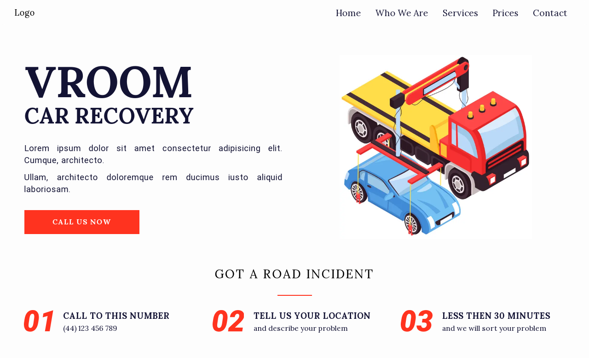

<a id="readme-top"></a>

[](https://github.com/SavinRaulCalin/Car-Recovery-Template-v1/actions/workflows/CI.yml)

## About The Project

<figure>
  <a href="https://car-recovery-template-v1.vercel.app" target="_blank">
    
  </a>
</figure>

- This <i>car-recovery-template-v1</i> repository features a
  comprehensive towing car description, detailing specifications,
  functionalities, and design elements essential for understanding the
  towing vehicle's capabilities.

- This product features a meticulously organized codebase designed for
  seamless customization, allowing me to efficiently modify and adapt to
  meet specific project requirements.
- It has a clean, valid code and it is tested on a variety of
  resolutions and devices.

<p align="right">
  (<a href="#readme-top">back to top</a>)
</p>

### Built with

[](https://nextjs.org)
[](https://tailwindcss.com)

### Tested with

[](https://jestjs.io)

### Code quality

[](https://www.typescriptlang.org)
[](https://prettier.io)
[](https://eslint.org)

<p align="right">(<a href="#readme-top">back to top</a>)</p>

### Project Tree

```
📦 VroomCarRecovery
├─ app
│  ├─ (group)
|  |  ├─ prices
|  |  ├─ services
|  |  ├─ who-we-are
|  |  ├─ layout.tsx
│  └─ api
│  └─ contact
│  └─ layout.tsx
│  └─ not-found.tsx
│  └─ page.tsx
├─ components
├─ constants
├─ data
├─ lib
├─ style
├─ svg
├─ types
└─ utils

```

<p align="right">(<a href="#readme-top">back to top</a>)</p>

## Contact

Raul Savin

[](mailto:webdevraul.md@gmail.com) [](https://www.linkedin.com/in/raul-savin)

Project Link: [https://car-recovery-template-v1.vercel.app](https://car-recovery-template-v1.vercel.app)

<p align="right">(<a href="#readme-top">back to top</a>)</p>
